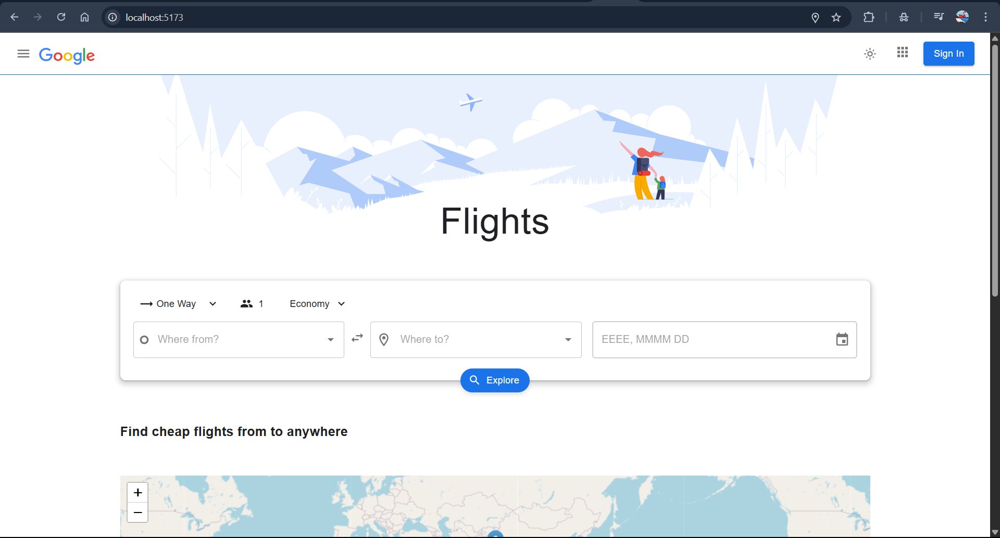

<h1> React - React MUI Google Flights App</h1>

 

# Google Flights App

This project is inspired by Google Flights and features one-way flight ticket search, listing flights, showing nearby airports based on your location, and displaying them on the map.

- [Vercel Live Link](https://google-flight-brown.vercel.app/)

## Used Technologies

- For FrontEnd;

  - React
  - Metarial UI
  - MUI Theme Provider
  - Leaflet
  - Axios
  - Dayjs
  - React Toastify
     

- Extracts;
  - Git
  - Github
  - Vercel

## Google Flight Basic Version Endpoint Path

- api/v1/flights/getNearByAirports
- api/v1/flights/searchAirport
- api/v2/flights/searchFlight

---

## FrontEnd Tasks

- This project has Home and Flight List pages.
- It also has Navbar, Footer, and the Nearby Airports section components.
- Material-UI is used for all responsive adjustments and design.
- Finally, the Flight List has two different component designs for responsive design.

---

Aayush Goel

